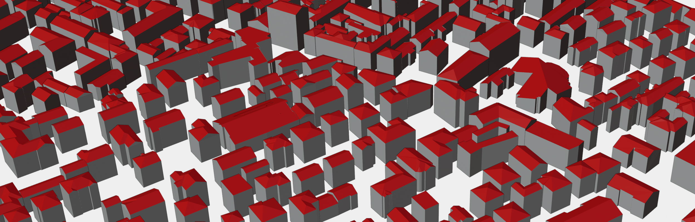

# CityZen: LOD2 building reconstruction with point cloud-free model-driven approach



CityZEN is a compact pipeline for generating LOD2 building models from aerial orthophotos. It keeps only the code needed for the current runtime path:

1. `DSMNet/test_dsm.py` predicts DSM/nDSM rasters and building masks.
2. `building_rooftype_classification/orthophoto_inference.py` classifies roof types from footprints and orthophotos.
3. `3dom-lod2-generator/tool/blender_main.py` reconstructs buildings in Blender.
4. `3dom-lod2-generator/tool/merge.py` merges per-building meshes and exports OBJ, PLY, and CityJSON.

## Repository Layout

```text
.
├── pipeline.py                    # Main pipeline entrypoint
├── pipeline.sh                       # Docker/Singularity wrapper for pipeline.py
├── ndsm_height_calibration.py     # Optional height calibration helper
├── DSMNet/                           # DSMNet inference code
├── building_rooftype_classification/ # Roof classification code
├── 3dom-lod2-generator/              # Blender reconstruction and merge code
└── data/                             # Input/output placeholders only
```

Training scripts, validation scripts, v1 entrypoints, demo images, generated data, checkpoints, model weights, logs, caches, and compiled build artifacts are intentionally excluded.

## Required Runtime Artifacts

Model files are not tracked in Git. Add them after cloning:

```text
DSMNet/checkpoints/mtl.weights.h5
DSMNet/checkpoints/refinement.weights.h5
building_rooftype_classification/models/best_fine_tuned_vgg16.keras
```

Input data should be placed under:

```text
data/input/ortho/       # orthophotos: tif, tiff, jp2, jpg, jpeg, png
data/input/footprints/  # required Shapefile footprints
data/output/            # generated outputs
```

## Docker

Build the image:

```bash
docker build -t cityzen-pipeline:latest .
```

Run:

```bash
docker run --rm --gpus all \
  -u "$(id -u):$(id -g)" \
  -v "$(pwd):/workspace" \
  cityzen-pipeline:latest \
  --ortho_path /workspace/data/input/ortho \
  --footprints_path /workspace/data/input/footprints \
  --output_dir /workspace/data/output
```

## Leonardo / Singularity

Create a Docker archive, build the SIF, then submit the job script:

```bash
docker save cityzen-pipeline:latest -o cityzen-pipeline.tar
./build-sif.sh
sbatch submit_job.sh
```

Before submitting, set your Slurm account in `submit_job.sh`. The script supports environment overrides such as `SIF`, `HOST_CITYZEN`, `DSMNET_CHECKPOINT_DIR`, and calibration variables.

## Outputs

```text
data/output/
├── dsm/          # DSM/nDSM rasters and semantic masks
├── rooftype/     # classified footprints and optional visualizations
├── 3d_models/    # merged OBJ, PLY, and CityJSON files
└── calibration/  # optional calibration reports
```

## Notes

- The Docker image installs Blender and CGAL, but the C++ skeleton helper under `3dom-lod2-generator/tool/cpp/` may still need to be built for your runtime environment.
- Large data and model artifacts should be distributed through releases, object storage, or another artifact host rather than committed to Git.
